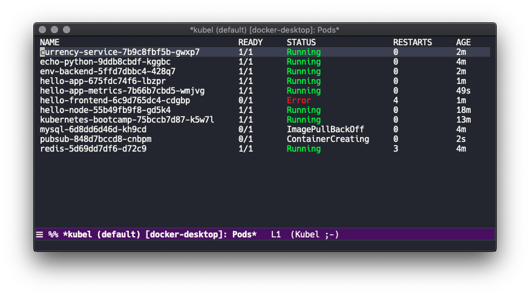

[](https://melpa.org/#/kubel)
[](https://app.circleci.com/pipelines/github/abrochard/kubel)

# kubel

Emacs extension for controlling Kubernetes with limited permissions.



You can [watch how kubel started](https://www.youtube.com/watch?v=w3krYEeqnyk) or [read about it](https://gist.github.com/abrochard/dd610fc4673593b7cbce7a0176d897de).

## Features
We now support managing pretty much any resource!

- switch context and namespace
- show any resource (pods/services/deployments/etc)
- highlight a resource by name
- copy resource name to clipboard
- show and edit resource details
- show rollout history for a resource
- delete a resource
- tail container logs (possibly with `-f` follow flag)
- copy container log command to clipboard
- port forward a pod to your localhost
- exec into a pod using tramp
- quick run shell-command
- scale replicas
- multiple kubel buffers, each one with different context, namespace, and resource.

## Installation

Get it from Melpa, or copy and load the `kubel.el` file.

If you want to have the evil compatibility package, get it from Melpa as well or
load the `kubel-evil.el` file.

## Setup

```elisp
(require 'kubel)
(kubel-vterm-setup) ; If you wish to have vterm as an option when using exec
```

Or if one uses `use-package`

```elisp
(use-package kubel
  :after (vterm)
  :config (kubel-vterm-setup))
```

## Usage

To list the pods in your current context and namespace, call
```
M-x kubel
```
To set said namespace and context, respectively call
```
M-x kubel-set-namespace
M-x kubel-set-context
```
Note that context will autocomplete but not necessarily namespaces
depending on your permissions and cluster setup.
See the [customize section](#Customize) on how to tune `kubel-use-namespace-list`.

To switch to showing a different resource, use the `R` command or
```
M-x kubel-set-resource
```
This will let you select a resource and re-display the kubel buffer.


To programmatically open a session for a specific context/namespace/resource, call `kubel-open` from elisp

```lisp
(kubel-open "<context>" "<namespace>" "<OPTIONAL resource>")
```

Each kubel buffer will automatically be renamed using the following template:
```
*kubel session: |<context>|<namespace>|<resource>|*
```

## Shortcuts

On the kubel screen, place your cursor on a resource
```
enter => get resource details
C-u enter => describe resource
h => help popup
? => help popup
! => quick run shell-command
E => quick edit any resource
g => refresh
k => delete popup
r => see the rollout history for resource
p => port forward pod
l => log popup
e => exec popup
j => jab deployment to force rolling update
S => scale resource replicas
C => set context
n => set namespace
R => set resource
K => set kubectl config file
F => set output format
f => set a substring filter for resource name
M-n => jump to the next highlighted resource
M-p => jump to previous highlighted resource
m => mark item
u => unmark item
M => mark all items
U => unmark all items
c => copy popup
$ => show process buffer
s => show only resources with specified label value
```

## Editing a resource

After describing a resource in YAML format, you can edit the buffer and hit `C-c C-c` to apply your changes.

For example, if you want to edit a deployment, you can switch the resource with `R` and select "Deployments", then press return with the cursor on the row you wish to edit, edit the buffer, and hit `C-c C-c` to apply.

Alternatively, you can hit `E` to then select the resource type and the resource name of what you want to edit.

## Customize

- By default, kubel log tails from the last 100 lines, you can change the `kubel-log-tail-n` variable to set another line number.
- If you need to switch or set your kubectl config file by setting your `KUBECONFIG` environment variable, you can use the wrapper function `kubel-set-kubectl-config-file` or the `K` shortcut.
- Namespace listing for auto-completion is controlled by `kubel-use-namespace-list`:
  - auto - default, use `kubectl auth can-i list namespace` to determine if we can list namespaces
  - on - always assume we can list namespaces
  - off - always assume we cannot list namespaces

## Releases

See the [CHANGELOG.md](CHANGELOG.md) for the list of changes and maybe upcoming features.
